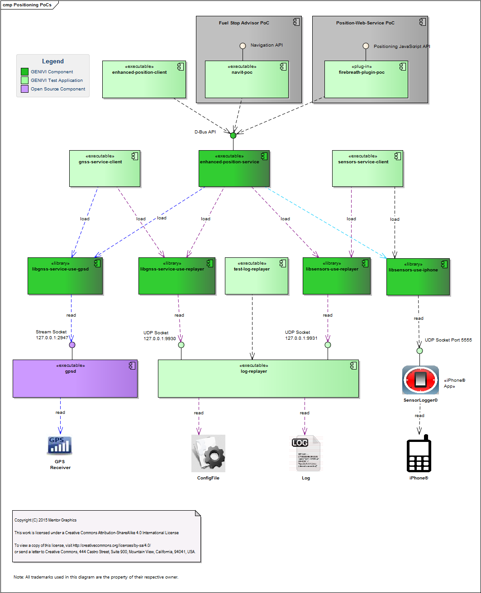

# Positioning Git Repository

The Positioning repository is a collection of APIs and corresponding proofs of concept:

* GNSSService
* SensorsService
* EnhancedPositionService
* Logger
* LogReplayer
* PositionWebService

Directory Structure

* enhanced-position-service   //three enhanced-position-service PoCs:  
                              1) with dbus interfaces, (official API)  
                              2) with commonapi-dbus interfaces,   
                              3) with commonapi-someip interfaces.  
* gnss-service                //gnss-service API + PoC
* logger                      //logger PoC
* log-replayer                //log-replayer PoC
* sensors-service             //sensors-service API + PoC 
* position-web-servce         //position-web-service PoC
* architecture.png            //architecture overview
* run-test.sh                 //script to run a quick test for each PoC (usage: run-test.sh help) 
* positioning_x.y.bb          //version x.y of a Yocto recipe for the positioning PoCs

## Architecture

  

## How To Build

To build the positioning proofs of concept please follow the following steps:
First create and enter the build folder

```
mkdir ./build
cd build
```

To build:

```
cmake ../
make
````

To build with tests:

```
cmake -DWITH_TESTS=ON -DWITH_DEBUG=ON ../
make
```

To build with dbus interfaces:

```
cmake -DWITH_DBUS_INTERFACE=ON -DWITH_FRANCA_DBUS_INTERFACE=OFF -DWITH_FRANCA_SOMEIP_INTERFACE=OFF -DWITH_TESTS=ON -DWITH_DEBUG=ON -DWITH_DLT=OFF -DCMAKE_BUILD_TYPE=Debug ../
make
```

To build with interfaces based on Franca and CommonAPI (see below how to configure CommonAPI):

```
cmake -DWITH_DBUS_INTERFACE=OFF -DWITH_FRANCA_DBUS_INTERFACE=ON -DWITH_FRANCA_SOMEIP_INTERFACE=ON 
-DWITH_TESTS=ON -DWITH_DEBUG=ON -DWITH_DLT=OFF -DCMAKE_BUILD_TYPE=Debug 
-DCOMMONAPI_TOOL_GENERATOR=<path to generator> 
-DCOMMONAPI_DBUS_TOOL_GENERATOR=<path to generator> 
-DCOMMONAPI_SOMEIP_TOOL_GENERATOR=<path to generator> 
-DDBUS_LIB_PATH=<path to patched DBus> ../
make
```

To build with tests and reading GPS NMEA data from a GPS receiver attached to /dev/ttyACM0 at 38400

```
cmake -DWITH_NMEA=ON -DWITH_TESTS=ON -DWITH_DEBUG=ON -DGNSS_DEVICE=\"/dev/ttyACM0\" -DGNSS_BAUDRATE=B38400 ../
make
```

To build with tests, with the logger, without the EnhancedPositionService, using as GNSS source a GPS receiver with a u-blox chipset and 50ms transmission delay providing NMEA data to /dev/ttyACM0 at 38400 baud, using as source for gyro and accelerometer data a LSM9DS1 sensor attached via I2C (e.g. from a Sense Hat module)

```
cmake -DWITH_ENHANCED_POSITION_SERVICE=OFF -DWITH_NMEA=ON -DWITH_SENSORS=ON -DIMU_TYPE=LSM9DS1 -DWITH_LOGGER=ON -DWITH_TESTS=ON -DWITH_DEBUG=ON -DGNSS_DEVICE=\"/dev/ttyACM0\" -DGNSS_BAUDRATE=B38400 -DGNSS_CHIPSET=UBLOX -DGNSS_DELAY=50 ../
make
```

## Compiler Options and Default Settings

* option(WITH_ENHANCED_POSITION_SERVICE
       "Build the Enhanced Positioning Service" ON)
* option(WITH_GNSS_SERVICE
       "Build the GNSS Service" ON)
* option(WITH_LOG_REPLAYER
       "Build the Log Replayer" ON)
* option(WITH_LOGGER
       "Build the Logger" OFF)
* option(WITH_SENSORS_SERVICE
       "Build the Sensors Service" ON)
* option(WITH_FRANCA_DBUS_INTERFACE
       "Build using the Franca DBus interfaces" OFF)
* option(WITH_FRANCA_SOMEIP_INTERFACE
       "Build using the Franca SomeIP interfaces" OFF)
* option(WITH_DBUS_INTERFACE
       "Build using the D-Bus interfaces" ON)
* option(WITH_DEBUG
       "Enable the debug messages" OFF)
* option(WITH_DLT
    "Enable DLT logging" OFF)
* option(WITH_GPSD
    "Use GPSD as source of GPS data" OFF)
* option(WITH_NMEA
    "Use NMEA as source of GPS data" OFF)
* option(WITH_REPLAYER
    "Use REPLAYER as source of GPS data" ON)
* option(WITH_TESTS
    "Compile test applications" OFF)
* option(WITH_IPHONE
    "Use IPHONE as source of sensors data" OFF)
* option(WITH_SENSORS
    "Use real sensors connected to the target device" OFF)

Just set the option to ON or OFF on the command line.

## How To Test

To test the positioning proofs of concept please use the following test application (under top folder):
(please note that you need to build with -DWITH_TESTS=ON and -DWITH_DEBUG=ON to see something displayed)

```
./run-test.sh [command]
```

service:
* gnss            Test GNSSService
* sns             Test SensorsService
* enhpos          Test EnhancedPositionService
* repl            Test Replayer
* kill            Kill all test applications
* help            Print Help

## Dependencies

You might have to install additional packages to compile and run the Positioning PoC.
This section tries to summarize those dependencies.
Also necessary commands to install those packages are provided for Debian
based systems (Ubuntu, Raspbian, ...) with the apt package manager.
Other Linux distributions (e.g. openSuSE) may require some adaptation as
the package names and even the package manager may be different.

CMake is used to create the make files

```
sudo apt-get install cmake
```

DWITH_GPSD=ON requires that the package 'gpsd' is installed.
To install 'gpsd', please execute the following command:
sudo apt-get install gpsd libgps-dev

To test the enhanced-position-service (dbus-service) the packages 'libdbus-1-dev', libdbus-c++-dev' and 'xsltproc' must be installed.
to install these packages, please execute the following command:

```
sudo apt-get install libdbus-1-dev libdbus-c++-dev xsltproc
sudo ldconfig 
```

To test the enhanced-position-service (commonapi-service) the package CommonAPI and CommonAPI code generators must be installed.
Please see: 

* <https://github.com/GENIVI/capicxx-core-runtime>
* <https://github.com/GENIVI/capicxx-core-tools>
* <https://github.com/GENIVI/capicxx-dbus-runtime>
* <https://github.com/GENIVI/capicxx-dbus-tools>
* <https://github.com/GENIVI/capicxx-someip-runtime>
* <https://github.com/GENIVI/capicxx-someip-tools>
* <https://github.com/GENIVI/vsomeip>

DWITH_TESTS=ON enables the compilation of the test application(s).

DWITH_DLT=ON requires that the DLT-daemon is installed.
To download the DLT-daemon, just execute the following command:

```
git clone https://github.com/GENIVI/dlt-daemon
```

To install the DLT-daemon, etxract the tarball and follow the 
instructions in the file install.txt.  

Note: You may have to call 

  ```
  export PKG_CONFIG_PATH=/usr/lib/pkgconfig
  ```

before 

  ```
  sudo ldconfig
  ```

to add DLT to the pkgconfig search path before calling cmake

DWITH_IPHONE=ON requires that the iPhone app 'SensorLogger' is
installed on a iPhone and that the option to broadcast the
sensor data is activated (port=5555).

DWITH_SENSORS=ON requires that the header file for I2C access
via the I2C user space driver (i2c-dev.h) is available on your system.
This header file is typically part of the libi2c-dev package.
If you do not find it there, try the i2c-tools package.
See also https://www.kernel.org/doc/Documentation/i2c/dev-interface
The concrete sensor types are specified by further defines, e.g
DIMU_TYPE for gyro/accelerometer

